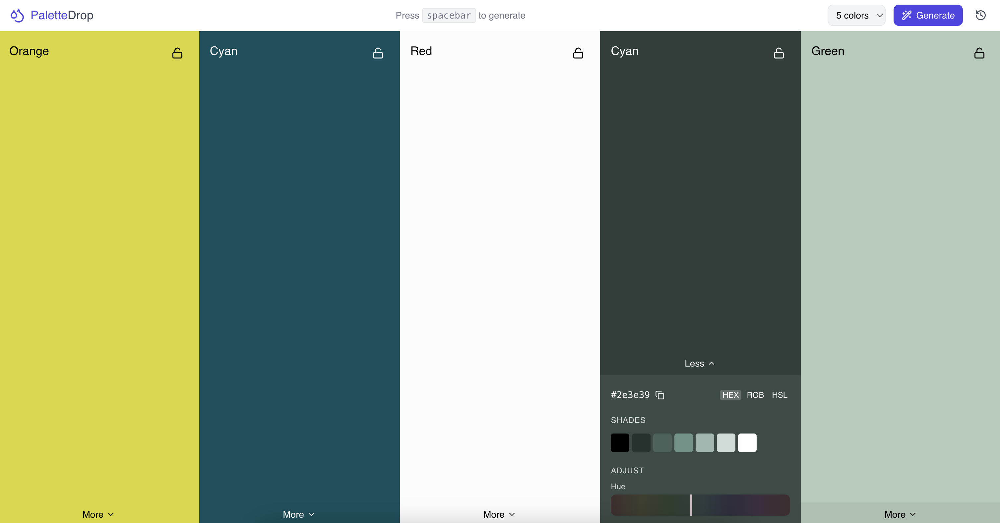

# PaletteDrop

A beautiful and intuitive color palette generator built with React, TypeScript, and Tailwind CSS.



## Features

- Generate beautiful color palettes
- Save your favorite palettes
- Modern, responsive design
- Built with React and TypeScript
- Styled with Tailwind CSS

## Getting Started

### Prerequisites

- Node.js (v14 or higher)
- npm or yarn

### Installation

1. Clone the repository:
```bash
git clone https://github.com/inkko44/palettedrop.git
cd palettedrop
```

2. Install dependencies:
```bash
npm install
# or
yarn install
```

3. Start the development server:
```bash
npm run dev
# or
yarn dev
```

4. Open [http://localhost:5173](http://localhost:5173) in your browser.

## Contributing

Contributions are welcome! Please feel free to submit a Pull Request. For major changes, please open an issue first to discuss what you would like to change.

1. Fork the repository
2. Create your feature branch (`git checkout -b feature/AmazingFeature`)
3. Commit your changes (`git commit -m 'Add some AmazingFeature'`)
4. Push to the branch (`git push origin feature/AmazingFeature`)
5. Open a Pull Request

## License

This project is licensed under the MIT License - see the [LICENSE](LICENSE) file for details.

## Acknowledgments

- Icons by [Lucide React](https://lucide.dev/)
- Stock photos by [Pexels](https://www.pexels.com/) 